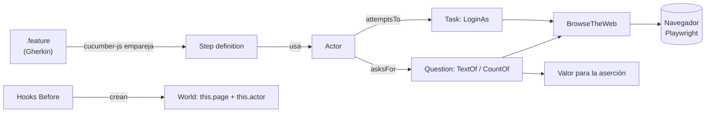

# Nivel 4.1 — BDD + Screenplay (integración)

> Lo mejor de los dos mundos: la **especificación legible** de Gherkin (Nivel 4)
> sobre la **arquitectura componible** de Screenplay (Nivel 3). El `.feature`
> describe el comportamiento; el Actor, las Tasks y las Questions ejecutan el
> _cómo_.

📖 Prerrequisitos: haber hecho el [Nivel 3 — Screenplay](nivel-3-screenplay.md)
y el [Nivel 4 — BDD](nivel-4-bdd.md).

## Objetivos

- Entender por qué conviene separar **qué** (Gherkin) de **cómo** (Screenplay).
- Conectar step definitions de Cucumber con un **Actor** de Screenplay.
- Mantener los step definitions **sin selectores** (viven en los Targets).
- Reutilizar el framework del Nivel 3 sin reescribir nada.

## La idea

En el Nivel 4, los step definitions manipulan la página directamente:

```ts
// Nivel 4 — el step conoce los selectores y el "cómo"
await this.page.locator('[data-test="username"]').fill(usuario);
await this.page.locator('[data-test="password"]').fill(contrasena);
await this.page.locator('[data-test="login-button"]').click();
```

En el Nivel 4.1, el step delega en el Actor: una sola línea de negocio.

```ts
// Nivel 4.1 — el step solo expresa la intención
await this.actor.attemptsTo(LoginAs.credentials(usuario, contrasena));
```

El selector ya no está en el step: vive en el `Target` (`@screenplay/ui`), y el
flujo de login lo encapsula la Task `LoginAs`. El step queda declarativo y la
lógica es reutilizable entre escenarios y entre niveles.

## Qué cambia respecto al Nivel 4

| Pieza           | Nivel 4 (BDD)                | Nivel 4.1 (BDD + Screenplay)                    |
| --------------- | ---------------------------- | ----------------------------------------------- |
| World (`this`)  | `this.page`                  | `this.page` **+ `this.actor`**                  |
| Hooks `Before`  | crean la `page`              | crean la `page` **y el Actor** con la habilidad |
| Step definition | usa `this.page.locator(...)` | usa `this.actor.attemptsTo(...) / asksFor(...)` |
| Selectores      | dentro del step              | en los `Target` de `@screenplay/ui`             |
| Aserciones      | sobre `this.page`            | sobre el valor de una **Question**              |

## Estructura

```
tests/nivel-4.1-bdd-screenplay/
└── login.feature                 # mismos escenarios Gherkin del Nivel 4
src/nivel-4.1-bdd-screenplay/
├── steps/
│   └── login.steps.ts            # steps que delegan en el Actor
└── support/
    ├── world.ts                  # World con page + actor
    └── hooks.ts                  # Before crea el Actor con BrowseTheWeb
```

> El framework Screenplay (Actor, Tasks, Questions, Targets) **no se duplica**:
> se importa del Nivel 3 con el alias `@screenplay/*`.

## Cómo encajan las piezas



1. El **World** guarda `page` y un `actor`.
2. Los **hooks** (`Before`) crean la página y un Actor con la habilidad
   `BrowseTheWeb.using(this.page)`.
3. El **step** traduce la línea Gherkin a `actor.attemptsTo(Task)` o
   `actor.asksFor(Question)`.
4. La **Task/Question** del Nivel 3 hace el trabajo sobre el navegador.

## Por qué un perfil de Cucumber aparte

Cada nivel BDD define el step `Dado que estoy en la página de login`. Si los dos
conjuntos de step definitions se cargaran juntos, Cucumber lanzaría un error de
**step ambiguo/duplicado**. Por eso `cucumber.js` usa **perfiles**: el `default`
carga solo el Nivel 4 y el perfil `nivel41` solo el Nivel 4.1.

## Ejecutar

```bash
npm run test:nivel-4.1
```

El reporte HTML queda en `playwright-report/cucumber-nivel-4.1.html`.

## Ejercicio del nivel

En una rama `feature/<tu-nombre>-nivel4.1`:

1. Crea `carrito.feature` con un escenario para agregar un producto al carrito.
2. Implementa los steps **sin selectores**: usa (o crea, en el Nivel 3) una
   Task `AddProductToCart` y una Question para el badge del carrito.
3. Añade un escenario de logout reutilizando una Task `Logout`.
4. Ejecuta solo tu feature con tags y abre un PR a `develop`.

## Buenas prácticas

- El step expresa **intención**, no mecánica: una Task por acción de negocio.
- Cero selectores en steps ni en `.feature`: van en los `Target`.
- Si un step necesita un dato del sistema, hazlo con una **Question**, no
  leyendo `this.page` directamente.
- Reutiliza Tasks/Questions entre el Nivel 3 y el 4.1 — esa es la ventaja.

---

<sub>📚 <a href="../README.md">Índice de documentación</a> · <a href="../../README.md">Inicio del repositorio</a></sub>
