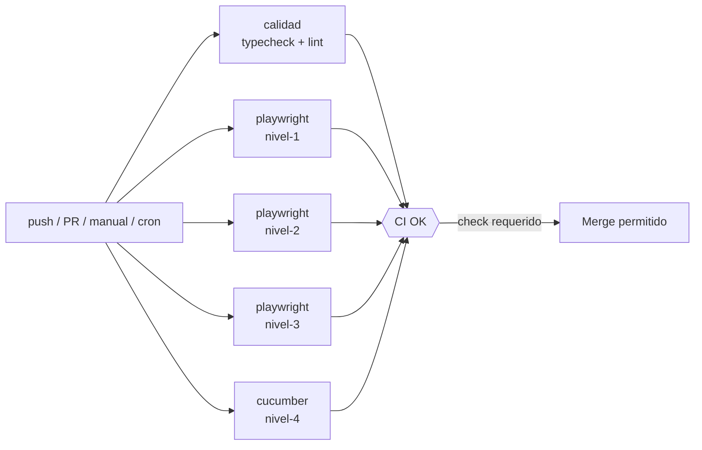

# Nivel 5 — Integración Continua (CI)

> Ejecutar automáticamente todas las suites (niveles 1–4) en cada push y Pull
> Request mediante **GitHub Actions**.

📖 Antes de este nivel, lee la guía conceptual: [guia-ci.md](../02-guias/guia-ci.md).

## Objetivos

- Entender qué es CI/CD y por qué es clave en QA Automation.
- Leer y modificar un workflow de GitHub Actions.
- Ejecutar las pruebas en la nube (push, PR, manual, programado).
- Usar matrices, artefactos y un job agregador como puerta de calidad.

## El pipeline del proyecto

Todo vive en un solo archivo: [`.github/workflows/e2e.yml`](../../.github/workflows/e2e.yml).



### Jobs

| Job          | Qué hace                                            |
| ------------ | --------------------------------------------------- |
| `calidad`    | `npm run typecheck` + `npm run lint`                |
| `playwright` | Matriz: corre cada nivel 1–3 como job independiente |
| `cucumber`   | Corre el nivel 4 (`npm run test:nivel-4`)           |
| `ci-ok`      | Agregador: pasa solo si los anteriores pasaron      |

### Disparadores (triggers)

```yaml
on:
  push: { branches: [main, develop] }
  pull_request: { branches: [main, develop] }
  workflow_dispatch: # botón "Run workflow" en la UI
  schedule:
    - cron: '0 6 * * 1-5' # 06:00 UTC, lun-vie (nightly)
```

## Cómo ejecutarlo

- **Automático:** al hacer push a `main`/`develop` o abrir un PR.
- **Manual:** pestaña **Actions → E2E → Run workflow**.
- **Programado:** corre solo cada mañana (lun–vie).

## Cómo leer los resultados

1. Ve a la pestaña **Actions** del repositorio.
2. Abre la ejecución → verás los jobs (`calidad`, `playwright (nivel-1-basico)`,
   etc.).
3. Si algo falla, abre el job para ver el log del step que falló.
4. Descarga el **reporte** desde la sección _Artifacts_ de la ejecución
   (`playwright-report-<nivel>` o `cucumber-report`).

## Puerta de calidad (branch protection)

`main` y `develop` están protegidas y exigen:

- El check **`CI OK`** en verde.
- Al menos **1 aprobación** de revisión.

Por eso un PR no se puede mergear si la CI falla: el pipeline es la red de
seguridad del equipo.

## Conceptos clave usados

- **Matrix** (`strategy.matrix`) para correr los niveles en paralelo.
- **`needs`** para que `ci-ok` espere a los demás.
- **`if: always()`** para subir reportes aunque las pruebas fallen.
- **`concurrency`** para cancelar ejecuciones viejas del mismo branch.
- **Caché de npm** y `npm ci` para velocidad y reproducibilidad.

## Ejercicio del nivel

En una rama `feature/<tu-nombre>-nivel5`:

1. Agrega un job `lint-only` que corra solo `npm run format -- --check`.
2. Añade el navegador **Firefox** a la matriz de `playwright` (pista:
   agrega un project en `playwright.config.ts` y un valor a la matriz).
3. Agrega el **badge** de estado del workflow al README.
4. Abre un PR a `develop` y observa la CI ejecutándose sobre tu PR.

## Buenas prácticas

- Mantén la CI **rápida** (caché, paralelismo, instalar lo mínimo).
- Sube **siempre** los reportes (`if: always()`).
- Requiere un **único check agregador** en la protección de ramas.
- No guardes secretos en el YAML: usa _GitHub Secrets_.

---

<sub>📚 <a href="../README.md">Índice de documentación</a> · <a href="../../README.md">Inicio del repositorio</a></sub>
