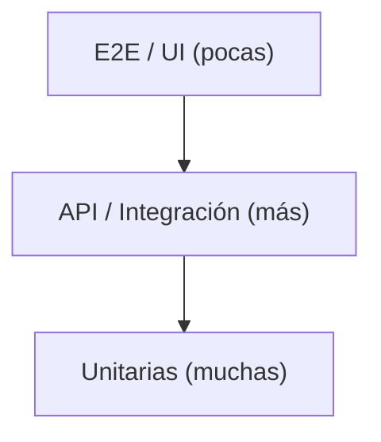

# Guía de pruebas de API

Guía conceptual de testing de APIs, base teórica del
[Nivel 6](../01-niveles/nivel-6-api.md).

---

## 1. ¿Qué es una prueba de API?

Es una prueba que interactúa **directamente con el backend** vía HTTP, sin pasar
por la interfaz gráfica. Envía una petición (request) y valida la respuesta
(response): estado, cuerpo, cabeceras y tiempo.

## 2. La pirámide de pruebas



Las pruebas de API están en el medio: más rápidas y estables que las de UI, y
cubren la lógica de negocio. La recomendación es tener **muchas** de API y
**pocas** E2E de UI (estas últimas, lentas y frágiles).

## 3. Anatomía de una petición/respuesta HTTP

- **Método:** `GET` (leer), `POST` (crear), `PUT`/`PATCH` (actualizar),
  `DELETE` (borrar).
- **URL + ruta:** `https://api.ejemplo.com` + `/posts/1`.
- **Cabeceras (headers):** `Content-Type`, `Authorization`, etc.
- **Cuerpo (body):** datos enviados (normalmente JSON).
- **Respuesta:** **código de estado** + cuerpo + cabeceras.

### Códigos de estado más comunes

| Código | Significado                 |
| ------ | --------------------------- |
| 200    | OK                          |
| 201    | Creado                      |
| 204    | OK, sin contenido           |
| 400    | Petición inválida (cliente) |
| 401    | No autenticado              |
| 403    | No autorizado               |
| 404    | No encontrado               |
| 500    | Error del servidor          |

## 4. El cliente `request` de Playwright

Playwright trae un cliente HTTP integrado (`APIRequestContext`), disponible
como fixture `request`:

```ts
import { test, expect } from '@playwright/test';

test('crear y leer', async ({ request }) => {
  const create = await request.post('/posts', {
    data: { title: 'Hola', body: 'Mundo', userId: 1 },
  });
  expect(create.status()).toBe(201);

  const get = await request.get('/posts/1');
  expect(get.ok()).toBeTruthy();
});
```

Métodos útiles de la respuesta: `status()`, `ok()`, `json()`, `text()`,
`headers()`.

## 5. Qué validar (y cómo)

1. **Código de estado:** lo primero. `expect(res.status()).toBe(200)`.
2. **Cuerpo:** parsea con `res.json()` y valida campos.
3. **Contrato/forma:** que existan los campos y con el tipo correcto.
4. **Casos de error:** 400/401/404 cuando corresponde (no solo el "camino feliz").

```ts
const body = await res.json();
expect(body).toMatchObject({ id: 1 });
expect(typeof body.title).toBe('string');
```

## 6. Autenticación

Para APIs protegidas, enviar el token en las cabeceras (nunca en el código):

```ts
const res = await request.get('/privado', {
  headers: { Authorization: `Bearer ${process.env.API_TOKEN}` },
});
```

El token va en `.env` / GitHub Secrets, jamás "hardcodeado".

## 7. Organización: API client

Igual que el POM encapsula páginas, un **API client** encapsula rutas:

```ts
export class PostsApi {
  constructor(private readonly request: APIRequestContext) {}
  list() {
    return this.request.get('/posts');
  }
  create(data) {
    return this.request.post('/posts', { data });
  }
}
```

Beneficios: rutas en un solo lugar, tests legibles, fácil de mantener.

## 8. Combinar API + UI

Una práctica potente: **preparar el estado por API** (rápido) y **verificar por
la UI**. Ej.: crear un usuario vía API y luego comprobar que aparece en la
pantalla. Reduce tiempo y fragilidad.

## 9. Buenas prácticas

- Tests **independientes** y sin orden fijo.
- Valida estado **y** cuerpo, no solo el `200`.
- Cubre también **errores** (400/401/404).
- Encapsula rutas en un API client.
- Datos sensibles en `.env`/Secrets.
- No dependas de datos que otro test creó.

## 10. Errores comunes

- Validar solo el estado y no el cuerpo.
- Probar únicamente el "camino feliz".
- Hardcodear tokens o URLs absolutas en cada test.
- Tests acoplados (uno necesita que otro corra antes).

---

<sub>📚 <a href="../README.md">Índice de documentación</a> · <a href="../../README.md">Inicio del repositorio</a></sub>
