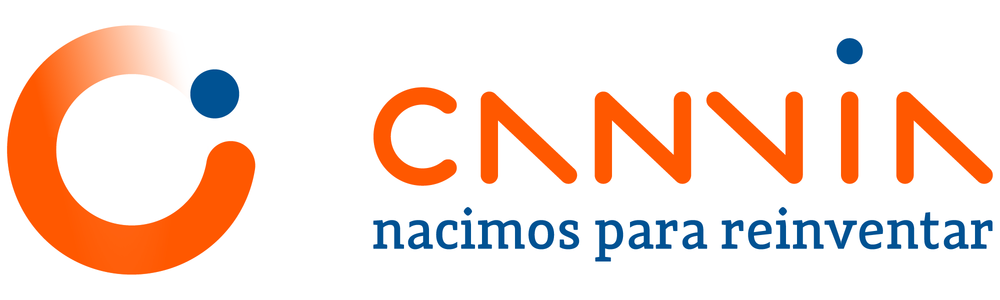

  

  <h1>Documentación · Canvia Playwright Training</h1>
  
Índice central de toda la documentación de la capacitación.

---

## 🚀 Empezar aquí

1. [Configuración del entorno](00-inicio/configuracion-entorno.md) — deja tu máquina lista desde cero.
2. [Sílabus](00-inicio/silabus.md) — el plan completo de 10 clases (5 niveles).
3. [Banco de ejercicios](00-inicio/ejercicios.md) — práctica por nivel y cómo entregarla.

## 📚 Niveles

| Nivel | Tema                   | Guía                                                      |
| ----- | ---------------------- | --------------------------------------------------------- |
| 1 🟢  | Fundamentos Playwright | [nivel-1-basico.md](01-niveles/nivel-1-basico.md)         |
| 2 🟡  | Page Object Model      | [nivel-2-pom.md](01-niveles/nivel-2-pom.md)               |
| 3 🔵  | Screenplay             | [nivel-3-screenplay.md](01-niveles/nivel-3-screenplay.md) |
| 4 🟣  | BDD con Cucumber       | [nivel-4-bdd.md](01-niveles/nivel-4-bdd.md)               |
| 5 🟠  | Integración Continua   | [nivel-5-ci.md](01-niveles/nivel-5-ci.md)                 |
| 6 🔴  | Pruebas de API         | [nivel-6-api.md](01-niveles/nivel-6-api.md)               |

## 🧠 Guías transversales

| Guía                                                  | Para qué                                    |
| ----------------------------------------------------- | ------------------------------------------- |
| [TypeScript](02-guias/guia-typescript.md)             | Conceptos de TS usados en el framework      |
| [BDD](02-guias/guia-bdd.md)                           | Teoría completa de BDD (Nivel 4)            |
| [CI/CD](02-guias/guia-ci.md)                          | Teoría de Integración Continua (Nivel 5)    |
| [API testing](02-guias/guia-api-testing.md)           | Teoría de pruebas de API (Nivel 6)          |
| [Buenas prácticas](02-guias/guia-buenas-practicas.md) | Reglas para tests estables y mantenibles    |
| [Depuración](02-guias/guia-depuracion.md)             | Cómo investigar y resolver tests que fallan |

## 🔧 Proceso de trabajo

| Documento                                          | Contenido                            |
| -------------------------------------------------- | ------------------------------------ |
| [Flujo de trabajo Git](03-proceso/git-workflow.md) | Modelo GitFlow, ramas, commits y PRs |
| [Guía de contribución](../CONTRIBUTING.md)         | Convenciones para contribuir         |

---

  Canvia · Capacitación interna de QA Automation

